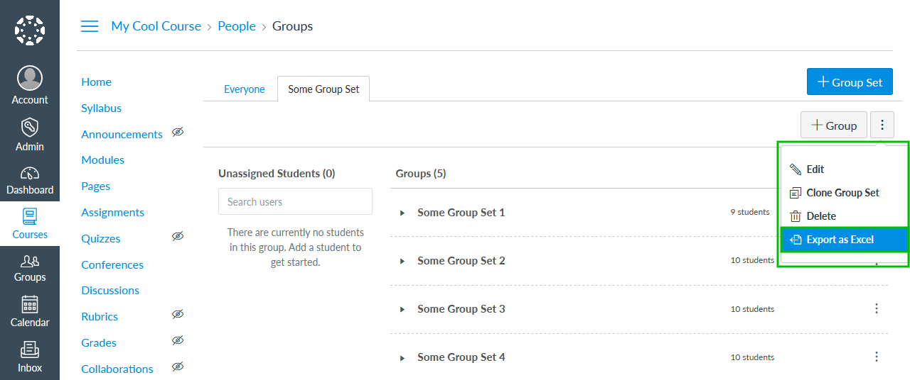

# Canvas LMS Export Course Groups Plug-in

[](https://www.npmjs.com/package/@artevelde-uas/canvas-lms-export-course-groups-plugin)
[](https://spdx.org/licenses/ISC)
[](https://www.npmjs.com/package/@artevelde-uas/canvas-lms-export-course-groups-plugin)

Plugin for the [Canvas LMS theme app](https://github.com/artevelde-uas/canvas-lms-app) that adds a menu item to export
course groups as Excel.



## Installation

Using NPM:

    npm install @artevelde-uas/canvas-lms-export-course-groups-plugin

Using Yarn:

    yarn add @artevelde-uas/canvas-lms-export-course-groups-plugin

## Usage

Just import the plug-in and add it to the Canvas app:

```javascript
import { run, addPlugin } from '@artevelde-uas/canvas-lms-app';
import exportCourseGroupsPlugin from '@artevelde-uas/canvas-lms-export-course-groups-plugin';

addPlugin(exportCourseGroupsPlugin);

run();
```
